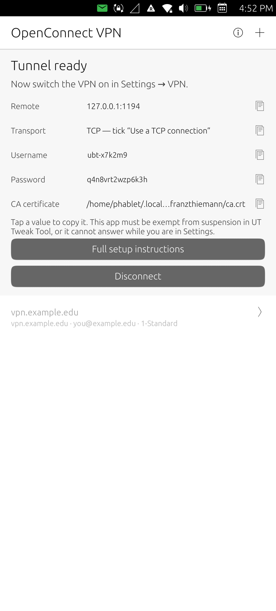
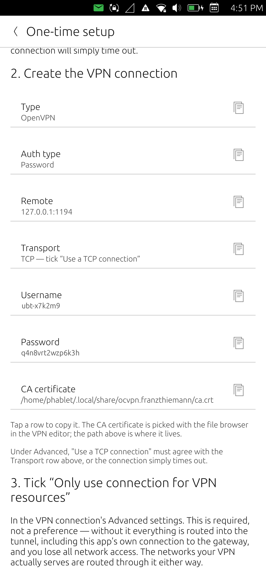

# OpenConnect VPN for Ubuntu Touch

A Cisco AnyConnect (OpenConnect) VPN client for Ubuntu Touch, packaged as an
ordinary **confined** click — no root, no `sudo`, no modification to the device.

<p align="center">
  
  
  
</p>

## Why this is not just "run openconnect"

`openconnect` needs a tun device and routing-table changes, which need root. A
click runs as `phablet` under AppArmor with no `capability` rule and no
`/dev/net/**` rule, and the `networking` policy group *explicitly denies*
NetworkManager's D-Bus API, so the app cannot even ask the system to bring a VPN
up. Ubuntu Touch also has no `VpnService` equivalent to hand an app a tun
descriptor, and `openconnect` is not in the rootfs at all.

So the app terminates the Cisco tunnel entirely in userspace and re-exposes it
as an OpenVPN server on loopback. Ubuntu Touch's *own* NetworkManager OpenVPN
client — which does run as root — connects to it and creates the real tun
device, installs the routes and owns DNS.

```
                     ── the click, all as phablet, all confined ──
Cisco ASA ──TLS/DTLS──> openconnect --script-tun
                             │  AF_UNIX SOCK_DGRAM, raw IP packets ($VPNFD)
                        ocbridge (Go)   generates config + PKI, relays packets
                             │  inherited fd used as openvpn's "tun"
                        openvpn --tls-server  (patched: no TUNSETIFF)
                             │  UDP 127.0.0.1:1194
────────────────────────────-┼───────────────────────────────────────────────
                   NetworkManager OpenVPN client (root, from Settings)
                             └─> tun0, routes, DNS
```

Two consequences worth knowing before you start:

- Because a confined app may not talk to NetworkManager, **the VPN is switched
  on and off in Settings**, not in the app. The app brings the Cisco side up
  and shows its state.
- The app **must be exempted from lifecycle suspension** (UT Tweak Tool →
  Lifecycle exceptions, the same list that keeps Terminal alive). Lomiri
  freezes an app's entire process tree when it loses focus -- `start_new_session`
  does not help -- and since the VPN is switched on from Settings, the app is
  always in the background at the moment its local server has to accept the
  connection. Without the exemption every attempt times out.

## Known limitations

- **Split tunnels only.** The VPN connection must have *Only use connection for
  VPN resources* ticked. Without it NetworkManager makes the VPN the default
  route, and this app's own connection to the gateway is then routed into the
  tunnel that carries it — the transport deadlocks and all network access is
  lost. A full tunnel cannot be supported: NetworkManager protects a VPN's
  transport using the VPN's remote address, which here is `127.0.0.1`, and a VPN
  plugin cannot install a route on the physical interface.
  The networks the gateway actually serves are routed through the tunnel either
  way, via the split routes it sends.
- **The app must be exempt from lifecycle suspension** (see above).
- IPv6 inside the tunnel is not carried yet.

## Repository layout

| Path | What it is |
|---|---|
| `src/ocbridge/` | The bridge. Go, stdlib only. Parses openconnect's `--script-tun` environment, generates the local CA and OpenVPN config, relays packets, publishes `status.json`. |
| `src/backend.py` | PyOtherSide control plane: process lifecycle and status. No data-plane work happens in Python. |
| `qml/` | The Lomiri UI. |
| `packaging/openvpn/` | The `--dev-node fd:N` patch and its GPLv2 source offer. |
| `tools/prebuild.sh` | The single build path for all three native components. Run by clickable's prebuild hook. |
| `tools/verify-click.sh` | Static checks on a built click before it reaches a device. |
| `tests/rig/` | An ocserv AnyConnect server in Docker, plus the end-to-end tests. No real VPN account needed. |
| `tasks/lessons.md` | Everything learned the hard way. Read this before changing anything load-bearing. |

## Building

```sh
clickable build --arch arm64      # always pass --arch with no device attached
tools/verify-click.sh             # dangling symlinks, ELF arch, NEEDED closure
```

The prebuild hook builds, inside the clickable container:

- **ocbridge** — `CGO_ENABLED=0`, so a static binary with no library closure.
- **openvpn 2.6.19**, patched to accept an inherited descriptor as its tun
  device, so it can serve without `/dev/net/tun` and without root.
- **openconnect 9.12**, built `--without-libproxy --without-stoken
  --without-libpcsclite --without-libpskc --without-gssapi` and statically
  linked against its own `libopenconnect`.

Both tarballs are pinned by SHA-256. The result ships **no shared libraries**:
everything it links is already in the Ubuntu Touch rootfs.

## Testing

```sh
cd src/ocbridge && go test ./...   # unit tests
clickable build --arch amd64       # binaries this machine can run
tests/rig/run-e2e.sh               # the whole chain against a real AnyConnect server
```

`run-e2e.sh` starts ocserv in Docker, runs openconnect → ocbridge → the patched
openvpn, connects an OpenVPN client to it, and checks that an ICMP echo injected
at the client end reaches the gateway and comes back. It runs inside an Ubuntu
24.04 container so the click's binaries are exercised against the same library
versions the device has.

## Licence

This project is **GPL-3.0-or-later**; see `LICENSE`.

It redistributes two patched upstream programs, each as a separate process:

- **OpenVPN** 2.6.19, GPL-2.0 — corresponding source in `packaging/openvpn/`
- **OpenConnect** 9.12, LGPL-2.1 — corresponding source in `packaging/openconnect/`

Both are built from upstream tarballs pinned by SHA-256 in `tools/prebuild.sh`,
with the patches applied at build time.
